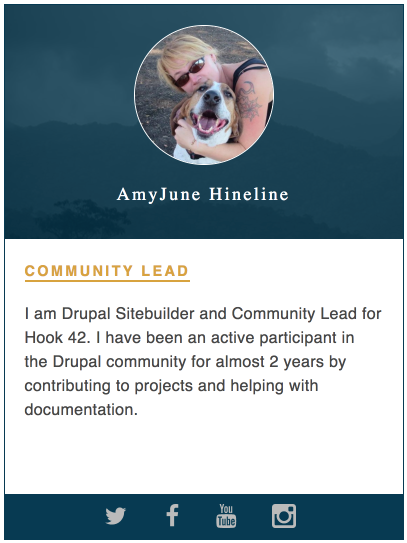

# Component Based Development in Drupal 8
The component based development training is broken down in 3 parts:

1. Building components in Twig using KSS Node.

2. Prepping Drupal for component integration.

3. Integrating components with Drupal.


## Local environment setup

During this training we will be using many of the popular front-end tools such as NodeJS, NVM, NPM, Gulp, and others.  Although it is recommended  you have these tools installed and in functioning state, the only one that is required to be installed is NVM.  Follow the instructions below for installing and configuring NVM in your local environment.  The rest of the tools will be installed as we run theme compiling tasks later in the training.

**NOTE**:  This is a full class and assistance with your local environment may be limited.

### Tools

The instructions provided with each tool are optional but recommended.  Feel free to improvise.

* Laptop computer (mac preferred)

* [Homebrew](https://brew.sh/): Package manager for OSx (optional)
<!-- * [NodeJS](https://nodejs.org/en/): For plugins and development tools.  You can [follow these instructions](https://changelog.com/posts/install-node-js-with-homebrew-on-os-x) if you are running MacOS. -->
<!-- * [NPM](https://www.npmjs.com/):  To manage node dependencies/packages -->
<!-- * [Gulp](https://gulpjs.com/): To automate many of the development taks we will perform regularly.  The first command on [these instructions](https://coolestguidesontheplanet.com/installing-gulp-on-osx-10-11-el-capitan/) should get you up and running with Gulp. -->
* [NVM](https://github.com/creationix/nvm): To manage version of Node across projects.
<!-- * [Mediacurrent's theme generator](https://github.com/mediacurrent/theme_generator_8).  We will install this during the training to generate a new base theme. -->

<!-- ### Disable Drupal 8 Caching & enable Twig Debugging
This is necessary to properly debug and inspect twig templates.
* https://www.drupal.org/node/2598914

### Drupal Modules
Install and enable the following modules (including dependencies):
* [Devel and Kint](https://www.drupal.org/project/devel)
* [Paragraphs](https://www.drupal.org/project/paragraphs)
* [Components Libraries](https://www.drupal.org/project/components)
* [UI_Patterns](https://www.drupal.org/project/ui_patterns).  **Do not enable until instructed to**
* [Admin Toolbar](https://www.drupal.org/project/admin_toolbar) (optional)

## Compiling Sass, Javascript and Styleguide
(_First two commands below only need to run once_)

* Navigate to `docroot/themes/custom/shiny` and run the following commands:

```
nvm install
```
This will install the node version declared in `.nvrrc`

```
npm install
```
This will install all theme plugins and dependencies

```
npm run build
```


### Other commands you can run
As you are actively working on your theme, you can run various gulp tasks individually depending on your needs:

```
npm run compile
```
Will compile Sass into CSS


```
npm run watch
```
Will watch for Sass changes and compile them into CSS automatically upon save.


```
npm run styleguide
```
Will rebuild the styleguide.


```
npm run compress
```
Will compress assets to optimize them for web.


#### Theme
If you are having difficulties configuring or getting Mediacurrent's theme generator
you can grab the `shiny` theme in this repo and save it in `docroot/themes/custom/`.


#### Styleguide
To view the styleguide navigate to `http://your-local/themes/custom/shiny/dist/style-guide/` -->
### Training Outline

1. [Create new Drupal 8 Theme](exercises/1-new-theme.md)

2. [Building a basic component](exercises/2-building-components.md)

3. [Building Social Icons component](exercises/3-building-components.md)

4. [Building an advanced component](exercises/4-building-components.md)

5. [Preparing Drupal for Component Integration](exercises/5-prepare-drupal.md)

6. [Integrating components with Drupal](exercises/6-integrating-components.md)

7. [Components Variations](exercises/7-components-variations.md)

8. [Integrating Featured Speakers](exercises/8-integrate-featured-speakers.md) (Complete instructions pending)


#### Preview of the Speaker card component

This is an example of the component we will be building and integrating during this training.



---


First Exercise:  [Create a new theme](exercises/1-new-theme.md)
