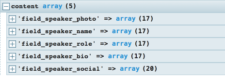
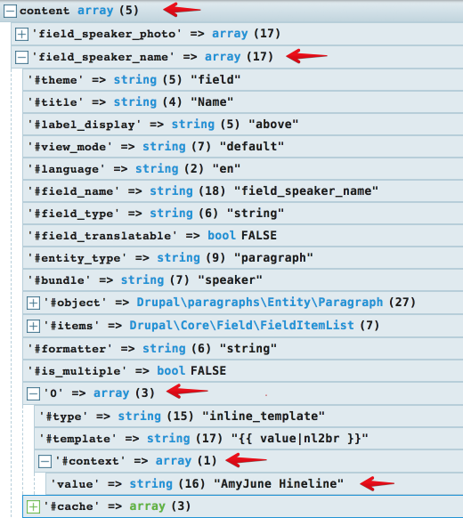

# Component-based Development with Drupal 8

## 3 - Integrate Components with Drupal

We are now ready to integrate the Speaker component with Drupal so it inherits all the markup and styles we wrote on the first step of this process.

### 3.1 Inspecting the Speaker Node
Let's take a look at the Basic page node we created previously now that we have enabled the Badcamp theme.
As you can see, the node renders but it lacks all the styles and markup we created when we built the Speaker component.  The reason for this is that Drupal still does not know about the Speaker component.  In this section we will take all the steps needed to make Drupal aware of our component and make the necessary configuration updates to complete the component integration.

* While displaying the Speaker node, right-click on it and choose **Inspect** or **Inspect element** from your browser's dialog box

* If you are looking at the _Elements_ tab within the browser's code inspector, you will see all the markup drupal is printing to render the component.  In addition, you will notice several lines of green information which normally you don't see.  The green text is Twig debbuging information, which will become really handy to integrate the component.

* Having access to Twig's debugging information allows us to easily identify which templates Drupal is using to render our content.

* I am particularly interested in the block of code that looks like this:


* Notice the template named `paragraph.html.twig`.  The **X** next to it indicates this is the paragraph template Drupal is using to render our component.
Also notice the path I have outlined in red.  This is telling us where that template is coming from in the event we want to override it.


### 3.2 Creating a custom twig template suggestion

As we saw above, Drupal is using `paragraph.html.twig` to render the Speaker component.  The problem is that the default paragraph template will not work to render the component properly becaue it lacks the markup necessary to structure the component.

Luckily for us, we can customize the paragraph template to control how the Speaker component is rendered. Although we can easily navigate to the path shown in the debugging screenshot above, it is not recommended to override Core or Module's templates.  Instead, we are going to create a copy of the paragraph twig template inside our theme.  This is the recommended way for overriding any twig template.

#### 3.2.1 Copy and rename Paragraph template into Badcamp theme

* Navigate to `/modules/contrib/paragraphs/templates/`

* Copy `paragraph.html.twig` into `/themes/custom/badcamp/src/templates/paragraphs`.  **Note**: The `paragraphs` directory in the path is not required, but it's a great way to organize your templates if you intend to have many of them in your theme.

* Rename the template `paragraph--speaker.hteml.twig`.  If you are wondering why that name or how do we know we can use that name, take another look at the debugging screenshot and you will notice that in addition to providing the current template name being used to render the component, Drupal also offers suggestions for template names that would be more specific to the content we are working with.  In our case, the `paragraph--speaker.html.twig` template, will ensure it only affects the Speaker content and not other paragraph types we may create later on.

Learn more about [Twig templates naming conventions](https://www.drupal.org/docs/8/theming/twig/twig-template-naming-conventions).

* Clear Drupal's cache and reload your page to ensure Drupal recognizes the new twig template we just created.

* If you inspect the speaker node again, you should see our newly created paragraph template being used to render the Speaker component. In addition, the path of the template points to our theme's location where we saved the template.


### 3.3 Integrating the Speaker component

Now that we have a custom twig template in place we are going to start the integration process.

#### 3.3.1 Using Kint to debug twig

Before we can fully integrate the Speaker component with Drupal, we need to determine which variables and values Drupal is parsing so we can pass that information to our component.  Learn more about [debuging with Kint here](https://drupalize.me/blog/201405/lets-debug-twig-drupal-8).  You can ignore the part about configuring twig debugging since we've already done that.

* Open `paragraph--teaser.html.twig` in your text editor.

* Add this line at the top of the _paragraph--teaser template_ `{{ kint(content) }}`.  This will allow us to inspect the variables and field values Drupal is printing to render the Speaker component.  Having this information available is extremely important as we will use this information to pass to our component.  Kint content looks like this:



Notice those are the same fields we created in Drupal's paragraph type which also match the data structure of our component.  If we expand each of those fields we will find the actual field structure we need to pass to the component to render the Drupal content we added when we created the Basic Page node.

**Example**
`'name': content.field_speaker_name.0['#context'].value,`

This is how we got the field structure above:




* In the paragraph template, find this line `{{ content }}`.  We will replace the **content** variable with our component by using a Twig's `include` statement as shown bellow:

```php
{# creates variable from render array to pass to speaker include #}


    
    
    



```
Let's go over the code above.

Most fields of the Speaker paragraph type provide a single value, however, the social media icons can have multiple values which needs special attention.  First we created a variable (`icons`) from the social media icons render array.  We looped through the list of possible values and populated the variable which we then pass to the Speaker component as as the value for the `items` variable.

The `include` statement above allows us to insert or nest a twig template inside another.  [Learn more about Twig includes](https://twig.symfony.com/doc/2.x/tags/include.html).

The following list of items in the snippet above represent the `key | value` format we first were introduced to when we created the JSON object for the Speaker component.

`'photo': content.field_speaker_photo`

**photo** is the variable the component expects which originated in the JSON object we previously created.

**content.field_speaker_xxxx** is the value coming from Drupal.  For styleguide purposes, we use JSON to pass stock/dummy content to the component, now that we are integrating the component in Drupal we can use real data from Drupal.

Notice in the code above the words `with` and `only`.  These allow us to restrict which data we can pass to our component.   Sometimes we may want to integrate the Speaker component with a limited number of fields.  The `with` and `only` will allow us to do so.

If we look at the entire code in the `paragraph--speaker.html.twig`, it shoudl look like this:

```php
{# creates variable from render array to pass to speaker include #}


    
    
    




  <div{{ attributes.addClass(classes) }}>
    

      

    
  </div>

```

### 3.4 Viewing the Speaker component in Drupal

After clearing Drupal's cache, you can refresh the page to load the speaker component.  This time the component within Drupal should look identical to the component we built in the styleguide.  The reason is that we are passing the styleguide component to drupal and along with that come the CSS and markup we wrote.


---

Previous exercise:  [Prepare Drupal for Integration](5-prepare-drupal.md)

[Back to beginning](../README.md)
